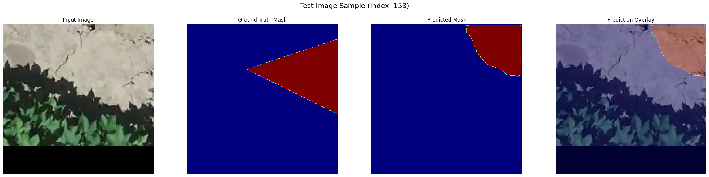
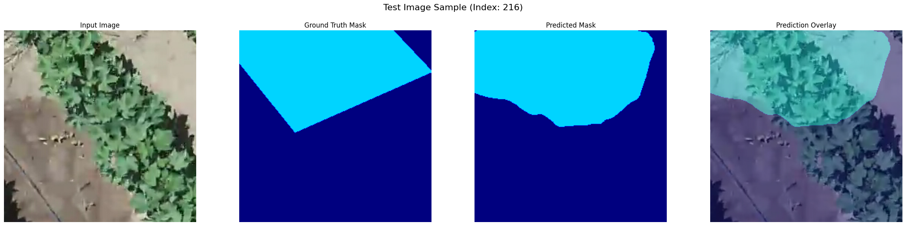

# Semantic Weed Segmentation using U-Net with ResNet101

This project performs semantic segmentation on the [CoFly-WeedDB](https://zenodo.org/records/6697343) dataset to identify and classify weeds from aerial imagery. It uses a U-Net model with a pre-trained ResNet101 backbone, implemented in TensorFlow and Keras.

## Pipeline Overview

1.  **Data Acquisition**: Downloads the CoFly-WeedDB dataset from Zenodo.
2.  **Preprocessing**:
    -   **Augmentation**: Applies transformations like flips, rotations, and distortions to increase dataset variety.
    -   **Patching**: Divides large images into 256x256 patches, filtering for those with significant weed presence.
3.  **Modeling**:
    -   **Architecture**: Implements a U-Net with a ResNet101 encoder, leveraging weights pre-trained on ImageNet.
    -   **Loss Function**: Uses a combination of Dice Loss and Focal Loss to handle class imbalance.
    -   **Training**: Trains the model with AdamW optimizer, EarlyStopping, and ReduceLROnPlateau callbacks.
4.  **Evaluation**: Assesses model performance on the test set using Mean Intersection over Union (mIoU) and provides a classification report.

## Key Results

The model was evaluated on the held-out test set, achieving the following performance:

-   **Test Loss**: -1.6290
-   **Test IoU Score**: 0.5424
-   **Test F1-Score**: 0.6391

### Classification Report

| Class        | Precision | Recall | F1-Score |
|--------------|:---------:|:------:|:--------:|
| Background   |   0.93    |  0.87  |   0.90   |
| Weed Type 1  |   0.66    |  0.73  |   0.69   |
| Weed Type 2  |   0.32    |  0.43  |   0.37   |
| Weed Type 3  |   0.54    |  0.70  |   0.61   |
|**Weighted Avg**|**0.86**  |**0.84**| **0.85** |

### Visual Inference Examples
The model demonstrates its ability to accurately segment weeds from the background in test images.

